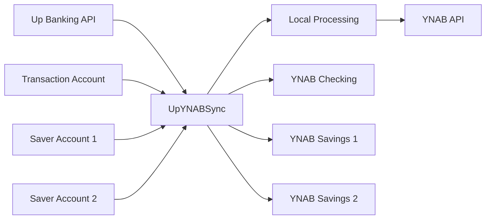

# UpYNABSync 🏦 ➡️ 💰

Automatically sync your Up Banking transactions to YNAB (You Need A Budget) with secure, local-only processing.

[](https://www.apple.com/macos/)
[](https://swift.org/)
[](https://www.youneedabudget.com/)

## ✨ Features

- 🔐 **Secure** - API tokens stored in macOS Keychain
- 🏦 **Multi-Account** - Supports transaction account + unlimited Saver accounts
- ⚡ **Automated** - Set-and-forget daily sync with Launch Agents
- 💰 **Accurate** - Validated amount conversion with duplicate detection
- 🛡️ **Private** - Local-only processing, no cloud services
- 🎯 **Smart** - Intelligent duplicate detection and error handling

## 🚀 Quick Start

### Prerequisites
- macOS (required for CLI tool and Keychain integration)
- Up Banking account with API access
- YNAB account with at least one budget

### Installation

1. **Clone and build:**
   ```bash
   git clone https://github.com/swiftdevstuff/UpYNABSync.git
   cd UpYNABSync
   swift build --configuration release
   sudo cp ./.build/release/up-ynab-sync /usr/local/bin/up-ynab-sync
   ```

2. **Set up authentication:**
   ```bash
   up-ynab-sync auth
   ```

3. **Configure account mapping:**
   ```bash
   up-ynab-sync config
   ```

4. **Sync your transactions:**
   ```bash
   up-ynab-sync sync
   ```

5. **Set up automation:**
   ```bash
   up-ynab-sync install
   ```

## 📖 Commands

| Command | Description |
|---------|-------------|
| `up-ynab-sync auth` | Set up API tokens securely |
| `up-ynab-sync config` | Map Up accounts to YNAB accounts |
| `up-ynab-sync sync` | Sync transactions (last 24 hours) |
| `up-ynab-sync sync --days 7` | Sync last 7 days |
| `up-ynab-sync sync --full` | Custom date range sync |
| `up-ynab-sync status` | Check sync status and health |
| `up-ynab-sync review` | Review failed transactions |
| `up-ynab-sync install` | Set up daily automation |
| `up-ynab-sync reset` | Reset all data and start fresh |

## 🔑 Getting API Tokens

### Up Banking
1. Open Up Banking mobile app
2. Go to **Settings → Security & Privacy → API Access**
3. Generate Personal Access Token
4. Copy token (format: `up:yeah:xxxxxxxxxx...`)

### YNAB
1. Log into [YNAB web app](https://app.ynab.com)
2. Go to **Account Settings → Developer Settings**
3. Create **New Token**
4. Copy the generated token

## 🏗️ How It Works



1. **Fetch** transactions from all mapped Up Banking accounts
2. **Process** locally with duplicate detection and amount validation
3. **Transform** data format (cents → milliunits) with validation
4. **Submit** to corresponding YNAB accounts
5. **Track** sync history and handle errors gracefully

## 🔒 Security & Privacy

- ✅ **Keychain Storage** - API tokens secured in macOS Keychain
- ✅ **Local Processing** - All data handled on your machine
- ✅ **Direct APIs Only** - Only communicates with Up Banking and YNAB
- ✅ **No Analytics** - Zero tracking or data collection
- ✅ **Open Source** - Fully auditable code

**Data Locations:**
- API Tokens: macOS Keychain (encrypted)
- Configuration: `~/.up-ynab-sync/config.json`
- Transaction History: `~/.up-ynab-sync/sync.db`
- Logs: `~/.up-ynab-sync/logs/`

## 📊 Example Usage

```bash
# Daily workflow
up-ynab-sync sync

# Catch up after vacation
up-ynab-sync sync --days 14

# Check everything is working
up-ynab-sync status

# Review any issues
up-ynab-sync review
```

**Example Output:**
```
🔄 Syncing transactions from Up Banking...
✅ Up Transaction Account: 5 new transactions synced
✅ Holiday Fund Saver: 1 new transaction synced  
✅ Emergency Fund Saver: 0 new transactions
📊 Total: 6 transactions synced successfully
⏱️  Completed in 2.3 seconds
```

## 🤝 Contributing

Contributions welcome! Please:

1. Fork the repository
2. Create a feature branch
3. Make your changes
4. Add tests for new functionality
5. Submit a pull request

## 📋 Requirements

- **macOS 12.0+** (for Keychain and Launch Agent support)
- **Swift 5.7+** (for modern concurrency features)
- **Xcode Command Line Tools**

**Dependencies:**
- [ArgumentParser](https://github.com/apple/swift-argument-parser) - CLI interface
- [SQLite.swift](https://github.com/stephencelis/SQLite.swift) - Local database

## 🐛 Troubleshooting

**Common Issues:**

- **"Authentication failed"** → Check API tokens are valid
- **"No new transactions"** → Normal if no recent activity
- **"Account mapping missing"** → Run `up-ynab-sync config`
- **Build errors** → Ensure Xcode Command Line Tools installed

**Get Help:**
- Check `up-ynab-sync status` for connectivity
- View logs in `~/.up-ynab-sync/logs/`
- Use `up-ynab-sync reset` for fresh start

## 📜 License

This project is licensed under the MIT License - see the [LICENSE](LICENSE) file for details.

## ⚠️ Disclaimer

This tool accesses your financial data. While designed with security best practices:
- Review all synced transactions for accuracy
- Keep your API tokens secure
- Use at your own risk

**Not affiliated with Up Banking or YNAB.**

---

<p align="center">
  <strong>Made with ❤️ for the Up Banking and YNAB community</strong>
</p>
